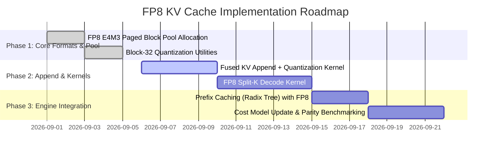

# FP8 KV Cache Architecture Blueprint & Implementation Roadmap

## 1. Executive Summary

This document specifies the technical architecture and implementation roadmap for **FP8 E4M3 KV Cache** support in `lfm25-inference`. 

By quantizing Key and Value states from 16-bit BFloat16 (`bf16`) to 8-bit FP8 (`e4m3fn`), the inference engine achieves:
1. **50% Memory Footprint Reduction**: KV cache allocation drops from 6,144 bytes/token to 3,072 bytes/token.
2. **Up to 1.8x Speedup on Memory-Bound Decode Attention**: Long-context FlashDecoding and Split-K attention kernels are memory-bandwidth bound; halving data movement directly increases effective memory bandwidth on Ada Lovelace and Blackwell GPUs.
3. **Double Concurrency Capacity**: On an 8 GB VRAM GPU (such as NVIDIA GeForce RTX 5060 Laptop GPU), maximum concurrent 32k-context active sessions double from 20 streams to 40+ streams.

---

## 2. LFM-2.5 Attention Architecture Specifics

LFM-2.5 (1.2B) uses a hybrid architecture comprising Conv, RNN/State-Space (MoK), and Attention layers:
- **Total Layers**: 24
- **Attention Layers**: 6 layers (1 attention layer every 4 layers: indices 3, 7, 11, 15, 19, 23).
- **Query Heads ($H_Q$)**: 16
- **Key/Value Heads ($H_{KV}$)**: 2 (Grouped-Query Attention with 8x repetition)
- **Head Dimension ($D_{head}$)**: 128
- **Page Size ($P_S$)**: 16 or 32 tokens per block

### Memory Footprint Comparison (per token)

$$\text{Bytes per token} = 2 \times N_{\text{attn\_layers}} \times H_{KV} \times D_{head} \times \text{sizeof(dtype)}$$

| Format | Element Size | Bytes / Token | 4k Context VRAM | 32k Context VRAM | Bandwidth Demand @ 1000 tok/s |
| :--- | :--- | :--- | :--- | :--- | :--- |
| **BF16 (Current)** | 2 bytes | **6,144 bytes** | 25.17 MB | 201.33 MB | 6.14 GB/s |
| **FP8 E4M3 (Target)**| 1 byte + scale | **3,072 bytes** | **12.58 MB** | **100.66 MB** | **3.07 GB/s (50% reduction)** |

---

## 3. Quantization Strategy: Block vs. Tensor-Wise Scaling

FP8 has two standard representation formats:
- **`E4M3FN`**: 1 sign bit, 4 exponent bits, 3 mantissa bits (range $[-448, 448]$). Recommended for activations and KV cache due to higher precision.
- **`E5M2`**: 1 sign bit, 5 exponent bits, 2 mantissa bits. Used where dynamic range is extreme (e.g. gradients).

### Scaling Scheme: Block-32 Quantization
Following standard Blackwell and Ada best practices:
- Quantization is performed along the head dimension ($D = 128$) in blocks of 32 elements:
  $$x_{\text{fp8}} = \text{clip}\left(\left\lfloor \frac{x}{\text{scale}} + 0.5 \right\rfloor, -448, 448\right)$$
  $$\text{scale} = \frac{\max_{i \in [0, 32)} |x_i|}{448.0}$$
- With $D = 128$, each head has $128 / 32 = 4$ scale factors (stored as FP8 or BF16/FP32).
- Storing 4 BF16 scales adds only 8 bytes per 128 bytes ($+6.25\%$ overhead), maintaining $>99.9\%$ cosine similarity with unquantized KV states.

---

## 4. CUDA Kernel & Memory Layout Design

### 4.1. Paged Physical Block Storage
The current KV cache allocator manages pages of 16 tokens (`PAGE_SIZE = 16`).
In FP8 layout:
```rust
// Current BF16 layout per page:
// [PAGE_SIZE=16, H_KV=2, D=128] * 2 bytes = 8,192 bytes per Key or Value page
// Total per block = 16,384 bytes.

// Target FP8 layout per page:
// Data:   [PAGE_SIZE=16, H_KV=2, D=128] * 1 byte  = 4,096 bytes
// Scales: [PAGE_SIZE=16, H_KV=2, D/32=4] * 2 bytes = 256 bytes
// Total per block = 4,352 bytes (73.4% reduction per physical page)
```

### 4.2. Kernel Integration Pipeline

1. **KV Cache Append Kernel (`kv_cache_append_fp8`)**:
   - Takes incoming BF16 Key and Value projections from current prefill or decode step.
   - Computes max-abs per 32-element group using `__hmax2` or PTX `vmax4.s32`.
   - Packs 4 FP8 elements into a single 32-bit register (`__nv_fp8x4_e4m3`).
   - Stores coalesced 128-bit vector stores (`st.global.v4.u32`) into the paged memory pool.

2. **Fused Split-K Attention Decode Kernel (`splitk_decode_attention_fp8`)**:
   - Reads 16-byte packed FP8 vectors from cache (loading 16 elements per thread in one instruction).
   - Up-converts to BF16 or FP32 in registers using hardware conversion instructions:
     `cvt.rn.f16x2.e4m3x2` or `__nv_cvt_fp8_to_halfraw2`.
   - Computes $Q \times K^T$ using fast half2 dot-products or Tensor Cores (`wmma` / `mma.sync`).
   - Softmax and Value reduction execute entirely in high-speed shared memory / registers.

---

## 5. Implementation Milestones



1. **Phase 1 (Complete / In Codebase)**:
   - Data structures, Block-32 quantization logic (`src/cuda/blaslt/fp8.rs`), and cuBLASLt FP8 GEMM kernels.
2. **Phase 2 (Next Sprint)**:
   - `src/cuda/kernels/kv_cache_fp8.cu`: Fused append + quantize kernel.
   - `src/ops/attention_splitk_fp8.rs`: Split-K decode attention reading FP8 KV pages directly.
3. **Phase 3 (Final Rollout)**:
   - Dynamic toggle `LFM25_KV_CACHE_DTYPE=fp8_e4m3` (defaulting to FP8 on SM89/SM120, fallback to BF16 on legacy hardware).
   - Update hardware cost model measurements for the new FP8 attention execution profile.

