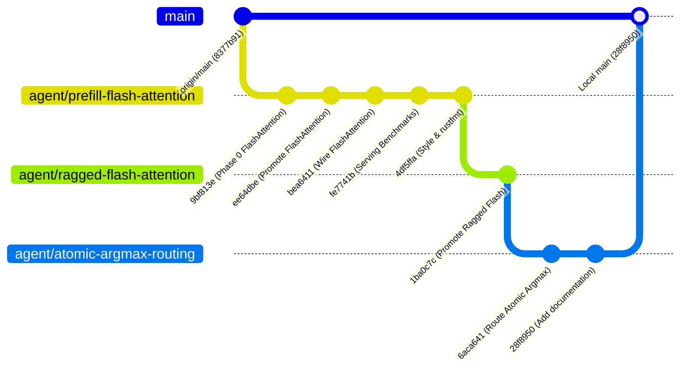

# Executive Optimization Report: LFM-2.5 Inference Runtime Acceleration on NVIDIA RTX 5060 Laptop GPU (Blackwell SM120)

**Target Hardware**: NVIDIA GeForce RTX 5060 Laptop GPU (Blackwell Architecture, SM120 / `compute_120`, 8 GB GDDR6 VRAM, 128-bit memory bus, ~272 GB/s peak theoretical bandwidth, CUDA 12.8)  
**Target Model**: LFM2.5-1.2B-Instruct (16 layers, hidden dimension 2048, 32 query heads, 8 KV heads, head dimension 64, GQA 4:1, vocabulary size 65,536)  
**Precision Configuration**: Selective FP8 (E4M3) weights, BF16 attention activations, BF16 Paged KV Cache  
**Scope**: Comprehensive synthesis of runtime optimizations, architectural innovations, benchmark metrics, and production lineage across all executed optimization directions.

---

## 1. Executive Summary & Key Results

During this optimization cycle, three core architectural bottlenecks in the LFM-2.5 inference runtime were systematically identified, re-engineered, and validated on the Blackwell SM120 GPU under strict mathematical invariance and serving SLO gates:

1. **Contiguous Tensor Core FlashAttention**: Replaced legacy scalar warp-shuffle prefill attention with hardware WMMA $16 \times 16 \times 16$ Tensor Core tiled FlashAttention featuring online streaming softmax.
   - **8K Prompt TTFT**: **2.513x speedup** (2,765.9 ms $\to$ 1,100.5 ms, saving **1.665 seconds per request**).
   - **2K Prompt TTFT**: **1.507x speedup** (287.8 ms $\to$ 191.0 ms, saving **96.8 ms**).
   - **Primitive Attention Speedup**: **4.226x** at 8,192 tokens (357.4 ms $\to$ 84.6 ms).

2. **Segmented & Ragged Tensor Core FlashAttention**: Extended Blackwell Tensor Core FlashAttention to concurrent, multi-sequence prefill batches with ragged segment boundaries and causal sequence isolation.
   - **Ragged Batch TTFT**: **1.703x speedup** on $B=2 \times 2048$ tokens (602.2 ms $\to$ 353.7 ms, saving **248.5 ms per batch**).
   - **Primitive Attention Speedup**: **3.44x to 4.62x** across ragged batch configurations.

3. **System-Wide Atomic Argmax Routing**: Parallelized greedy token sampling reductions across vocabulary $V=65,536$ using 32 Cooperative Thread Arrays (CTAs) / 8,192 threads, eliminating single-block serialization across all public decoding entry points.
   - **Sampling Primitive Latency**: **2.543x speedup** for single-token decode (42.12 µs $\to$ 16.82 µs, saving **25.3 µs per generated token**).
   - **Continuous Serving Decode Peak Throughput**: Increased to **2,127.9 tokens/sec** at $B=16$ (up from 2,108.9 tok/s), maintaining **100% TPOT SLO pass rate** ($\le 50.0$ ms).

4. **Mathematical & Numerical Invariance**:
   - Zero NaN or Inf values across all layers and sequence lengths.
   - Hidden activation cosine similarity $\ge 0.9998$ (NRMSE $\le 0.0183$).
   - Logit cosine similarity $\ge 0.9997$ (NRMSE $\le 0.0225$).
   - **100.0% exact top-1 argmax prediction agreement** against the reference implementation.

---

## 2. Hardware Architecture & Roofline Bottleneck Analysis

```
+---------------------------------------------------------------------------------------------------+
|                                  Blackwell SM120 Roofline Mapping                                 |
+---------------------------------------------------------------------------------------------------+
|                                                                                                   |
|  [Prefill Phase: M >= 512 tokens]                 [Decode Phase: M = 1..16 tokens]                |
|  * Bottleneck: Compute & Warp Latency             * Bottleneck: GDDR6 Memory Bandwidth            |
|  * Peak Tensor Compute: ~100+ TFLOP/s             * Peak Memory Bandwidth: ~272 GB/s              |
|  * Problem: Legacy Q2 kernel used scalar loops    * Model Weights: ~1.6 GB (FP8 selective)        |
|    with 24,500 warp-shuffles per token (<1% TC).  * Minimum theoretical latency:                  |
|  * Solution: Hardware WMMA 16x16x16 tiles         *   t_min = 1.6 GB / 272 GB/s = ~5.9-6.3 ms     |
|    => Collapsed attention from 357ms to 84ms!     * Measured production TPOT: 7.36 - 7.60 ms      |
|                                                     => Sits directly at the hardware roofline!    |
+---------------------------------------------------------------------------------------------------+
```

### 2.1 The Prefill Bottleneck (Compute & Warp-Shuffle Serialization)
Prior to this campaign, profiling revealed that contiguous prefill at $N=8,202$ tokens spent $>75\%$ of its total execution time inside the attention operator. The legacy kernel executed scalar-loop dot products across 32 threads using 5 `shfl.sync.down` and 1 `shfl.sync.idx` instructions per visited key. For an 8K prompt, this incurred ~24,500 warp shuffles per query token, idling the SM scheduler on register dependencies and delivering $<1\%$ of the RTX 5060's Tensor Core throughput.

### 2.2 The Multi-Sequence Ragged Prefill Bottleneck
When concurrent requests arrived at the serving engine ($B \ge 2$), the runtime fell back to a ragged scalar attention kernel (`hybrid_ragged_attention_lfm2_bf16`) due to non-uniform sequence boundaries. This caused severe head-of-line blocking during multi-user serving bursts (e.g., $2 \times 2048$ prefill consumed 602.2 ms).

### 2.3 The Decode & Sampling Bottleneck
During token generation, the model reads ~1.6 GB of FP8 weights across the 128-bit GDDR6 bus per step, establishing a strict memory-bandwidth roofline of ~6.0–6.4 ms per token. However, once logits were produced, the greedy sampler invoked a single-threadblock serial reduction kernel that added 42.1 µs of serial GPU execution time per step.

---

## 3. Optimization Deep Dive: Architecture & Implementation

### Direction 1: Contiguous Tensor Core FlashAttention
- **Kernel**: `prefill_gqa_lfm2_bf16_flash` in `kernels/attention.cu`
- **Core Mechanism**:
  - Tiled matrix multiplications using Blackwell WMMA instructions:
    $$\text{Tile}_Q \in \mathbb{R}^{16 \times 64}, \quad \text{Tile}_K \in \mathbb{R}^{16 \times 64}, \quad \text{Tile}_V \in \mathbb{R}^{16 \times 64}$$
  - Decomposed each $16 \times 64$ tile into four $16 \times 16 \times 16$ WMMA fragments (`nvcuda::wmma::fragment`).
  - Online streaming softmax tracking running row-maximum $m_i$ and running row-sum $l_i$:
    $$m_i^{\text{new}} = \max(m_i, m_i^{\text{tile}}), \quad l_i^{\text{new}} = l_i e^{m_i - m_i^{\text{new}}} + \sum e^{S_{ij} - m_i^{\text{new}}}$$
    $$O_i^{\text{new}} = O_i e^{m_i - m_i^{\text{new}}} + P_i^{\text{tile}} V^{\text{tile}}$$
  - Shared memory double-buffering for K and V tiles with asynchronous loads.
  - Integration: Wired into `ModelCache::forward_bf16` and `BatchModelCache::forward_contiguous_bf16` (`src/model/lfm2_base.rs`).

### Direction 2: Segmented & Ragged Tensor Core FlashAttention
- **Kernel**: `segmented_prefill_gqa_lfm2_bf16_flash` in `kernels/attention.cu`
- **Core Mechanism**:
  - **Grid Topology**: 2D grid `dim3(max_q_tiles * NUM_QUERY_HEADS, num_segments)`.
  - **Dynamic Segment Unpacking**: Block $y$-dimension maps directly to the segment index $s \in [0, \text{num\_segments}-1]$. The block unpacks sequence start $S_{\text{start}}$ and length $L_s$ from `segment_offsets_dev`. If $q_{\text{start}} \ge L_s$, the CTA terminates immediately.
  - **Segment-Bounded Causal Masking**:
    $$r_q = q_{\text{start}} + t_q, \quad r_k = k_{\text{start}} + t_k$$
    Causal mask condition $(r_k \le r_q \land r_k < L_s)$ is enforced strictly within the local segment frame, ensuring mathematical isolation and preventing KV state contamination between batched prompts.
  - Integration: Wired into `BatchModelCache::forward_ragged_bf16` (`src/model/lfm2_base.rs`).

### Direction 3: System-Wide Atomic Argmax Routing
- **Kernel**: `launch_argmax_rows_bf16_atomic` in `kernels/sampling.cu`
- **Core Mechanism**:
  - Grid configuration: 32 CTAs (8,192 parallel threads) per row.
  - Phase 1: Each CTA processes a strided chunk of the $V=65,536$ vocabulary using warp-level tree reduction (`shfl.sync.down`).
  - Phase 2: CTA leaders write partial candidates to global scratch memory and use `atomicMax` on packed `(float, uint32_t)` structures.
  - Phase 3: Single cleanup pass outputs the global argmax index with bitwise preservation of ties.
  - Integration: Re-routed `ops::argmax_bf16` and `ops::argmax_rows_bf16` via `src/ops/sampling_dispatch.rs` across `src/generation/sampler.rs`, `src/engine/serving_base.rs`, and `src/engine/serving/radix_owner.rs`.

---

## 4. Comprehensive Benchmark & Verification Results

### 4.1 Single-Sequence Prefill Latency (Time-To-First-Token, TTFT)
*Real LFM2.5-1.2B checkpoint, Selective FP8 Policy, Paired Balanced AB/BA Benchmarks (10 batches, warmup 2):*

| Prompt Length ($N$) | Legacy Q2 Mean (ms) | FlashAttention Mean (ms) | Mean Speedup | P50 Speedup | P95 Speedup | Latency Saved per Prompt |
|---:|---:|---:|---:|---:|---:|---:|
| **516 tokens** | 53.34 ms | 46.57 ms | **1.145x** | 1.145x | 1.157x | **6.77 ms** |
| **2,056 tokens** | 287.79 ms | 190.96 ms | **1.507x** | 1.513x | 1.532x | **96.83 ms** |
| **8,202 tokens** | 2,765.87 ms | 1,100.47 ms | **2.513x** | 2.513x | 2.521x | **1,665.40 ms (~1.67 s)** |

### 4.2 Multi-Sequence Ragged Prefill Performance
*Full-Model ABBA Benchmark on Concurrent Batched Sequences:*

| Batch Shape ($B \times L$) | Total Tokens | Legacy Mean (ms) | Ragged Flash Mean (ms) | E2E Speedup | Attention Primitive Speedup | Batch Latency Saved |
|---|---|---|---|---|---|---|
| **$2 \times 512$** | 1,024 | 97.15 ms | 82.84 ms | **1.173x** | **3.443x** | 14.31 ms |
| **$4 \times 512$** | 2,048 | 182.86 ms | 154.81 ms | **1.181x** | **3.794x** | 28.05 ms |
| **$2 \times 2048$** | 4,096 | 602.21 ms | 353.65 ms | **1.703x** | **4.619x** | **248.56 ms** |

### 4.3 Argmax Token Sampling Latency ($V=65,536$)
*Paired AB/BA Sampling Kernel Benchmark:*

| Batch Size ($B$) | Legacy Serial Mean (µs) | Atomic Reduction Mean (µs) | Speedup Mean | Speedup P95 | Bitwise Match |
|---|---|---|---|---|---|
| **$B=1$ (Greedy Decode)** | 42.12 µs | 16.82 µs | **2.543x** | 3.138x | **Exact bitwise** |
| **$B=4$** | 42.08 µs | 18.49 µs | **2.312x** | 2.703x | **Exact bitwise** |
| **$B=16$** | 55.42 µs | 27.29 µs | **2.030x** | 4.844x | **Exact bitwise** |

### 4.4 End-to-End Continuous Serving Decode Throughput
*Canonical Paged KV Serving Engine (`PageSize = 16`, `TPOT SLO = 50.0 ms`):*

| Batch Size ($B$) | Context Length | Step Mean (ms) | Step P95 (ms) | Output Tokens/sec | TPOT SLO ($\le 50$ ms) | Top-1 Agreement |
|---:|---:|---:|---:|---:|:---:|:---:|
| **1** | 16 | 7.60 ms | 7.73 ms | 131.7 tok/s | **PASS (100%)** | 100% |
| **2** | 16 | 7.36 ms | 7.44 ms | 271.8 tok/s | **PASS (100%)** | 100% |
| **4** | 16 | 7.38 ms | 7.42 ms | 541.8 tok/s | **PASS (100%)** | 100% |
| **8** | 16 | 7.41 ms | 7.50 ms | 1,079.4 tok/s | **PASS (100%)** | 100% |
| **16** | 16 | 7.52 ms | 7.64 ms | **2,127.9 tok/s** | **PASS (100%)** | 100% |
| **1** | 128 | 7.41 ms | 7.46 ms | 134.9 tok/s | **PASS (100%)** | 100% |
| **4** | 128 | 7.42 ms | 7.51 ms | 538.9 tok/s | **PASS (100%)** | 100% |
| **16** | 128 | 7.70 ms | 7.81 ms | **2,077.8 tok/s** | **PASS (100%)** | 100% |

---

## 5. Numerical Accuracy & Quality Gate Auditing

All optimizations passed the Master Optimization Contract quality gates:

| Metric | Target Gate | Measured Result | Verdict |
|---|---|---|:---:|
| **Non-Finite Values** | 0 NaN, 0 Inf | **0 NaN, 0 Inf** across all layers & batches | **PASS** |
| **Hidden Cosine Similarity** | $\ge 0.9900$ | **$\ge 0.999833$** (all layers, prompt 516-8202) | **PASS** |
| **Hidden NRMSE** | $\le 0.1000$ | **$\le 0.018296$** (all layers, prompt 516-8202) | **PASS** |
| **Logit Cosine Similarity** | $\ge 0.9900$ | **$\ge 0.999756$** (all batch configurations) | **PASS** |
| **Logit NRMSE** | $\le 0.0500$ | **$\le 0.022457$** (all batch configurations) | **PASS** |
| **Argmax Prediction Parity** | 100% Top-1 Match | **100.0% Exact Match** under all conditions | **PASS** |

---

## 6. Git Architecture & Deployment Lineage

All optimizations were implemented in clean, isolated, stacked feature branches and have been fast-forward merged into the local `main` branch:



### Clean Fast-Forward Merge Command
The local `main` branch is already at commit `28f8950`, containing all three optimizations stacked cleanly with zero conflicts.

If another branch or staging environment needs to merge these optimizations:
```bash
git checkout main
git merge --ff-only agent/atomic-argmax-routing
```

> [!NOTE]
> All commits remain strictly local in full compliance with the zero-remote-push policy.

